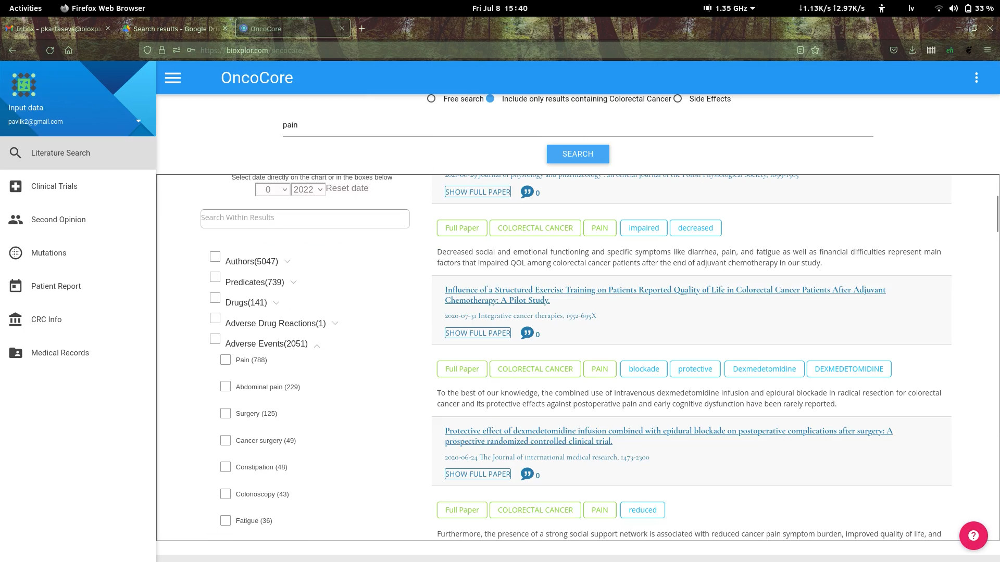
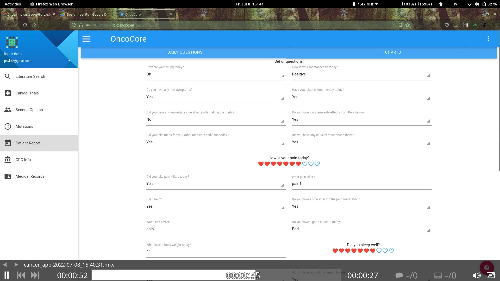
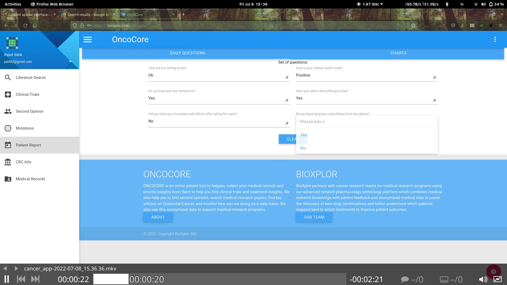

# BioXplor Ltd — Biomedical Software & IP Portfolio

BioXplor Ltd is a bioinformatics and biotechnology software company that developed software for biomedical literature analysis, drug indication expansion, ontology-based knowledge discovery, scientific image search, and patient-focused oncology applications.

The company is currently seeking a buyer for its intellectual property portfolio as part of an orderly company closure.

**Indicative asking price: approximately EUR 10,000 for the BioXplor Ltd IP portfolio.**

This repository contains demonstration videos and screenshots showing several BioXplor products and research tools.

---

## Intellectual Property Portfolio

### 1. Scientific Literature Search & Analysis

BioXplor developed technology for searching and analysing biomedical and scientific publications.

Core capabilities include:

- searching scientific literature for specific biomedical terms;
- analysing information at publication and sentence level;
- identifying co-occurrence between two, three, or more scientific terms;
- identifying indirect relationships between biomedical concepts;
- ontology-assisted filtering and categorisation;
- extracting structured knowledge from scientific publications.

Demo:

- `search_tool(stripped).mkv`

---

### 2. Indication Expansion Platform

The indication expansion technology was designed to help users discover relationships between diseases, drugs, treatments, genes, biological concepts, and other biomedical entities in scientific literature.

The platform can:

- search biomedical publications using user-defined queries;
- analyse results at sentence level;
- filter results using biomedical ontology terms;
- identify term co-occurrence and relationships;
- present extracted biomedical concepts alongside publications;
- provide visualisations to assist exploration of scientific evidence.

Several specialised versions were developed.

#### Academic Tool

Research-oriented version of the indication expansion platform for scientific literature exploration and biomedical relationship discovery.

Demo:

- `academic_tool.mkv`

#### COVID Explorer

Specialised literature exploration tool developed for COVID-19-related biomedical research.

Demo:

- `covid_explorer.mkv`

#### OncoExplorer

Oncology-oriented version for exploring cancer-related literature, treatments, drugs, diseases, and other biomedical concepts.

Demo:

- `onco_explorer.mkv`

#### Product Tool

Extended version of the literature platform capable of identifying and displaying products mentioned in scientific publications.

Demo:

- `product_tool.mkv`

---

### 3. Scientific Image Search & Analysis

BioXplor developed technology for searching figures and images contained in scientific publications.

Capabilities include:

- searching publication images using text associated with or contained in an image;
- searching by image category;
- identifying visually similar scientific images;
- linking figures back to relevant scientific publications;
- supporting structured analysis of publication figures.

Demo:

- `image_segmentation_tool.mkv`

---

### 4. Biomedical Databases

The BioXplor portfolio also includes remaining biomedical data assets created for the company's software platforms, including:

- biomedical term co-occurrence data;
- processed scientific publication sentences;
- structured literature-derived biomedical information;
- data used by the BioXplor search and indication-expansion applications.

The exact scope of transferable datasets can be discussed with an interested buyer.

---

## OncoCore Patient Application

BioXplor also developed **OncoCore**, an oncology-focused patient application.

The available demonstrations show functionality including:

- biomedical literature search;
- clinical-trial access;
- second-opinion functionality;
- mutation-related information;
- patient reports;
- colorectal cancer information;
- medical-record functionality;
- daily patient questionnaires;
- chemotherapy and side-effect tracking;
- pain and medication tracking;
- patient-reported health information.

Demo videos:

- `cancer_app-2022-07-08_15.36.36.mkv`
- `cancer_app-2022-07-08_15.40.31.mkv`

Screenshots:

  

<em>OncoCore biomedical literature search and ontology-assisted filtering.</em>

  

<em>OncoCore patient questionnaire and patient-reported outcome interface.</em>

  

<em>OncoCore oncology patient application interface.</em>

---

## Repository Contents

| File | Description |
|---|---|
| `academic_tool.mkv` | Academic biomedical literature and indication-expansion platform |
| `covid_explorer.mkv` | COVID-19 literature exploration application |
| `onco_explorer.mkv` | Oncology-focused literature and relationship exploration tool |
| `product_tool.mkv` | Biomedical literature tool with product identification |
| `search_tool(stripped).mkv` | Scientific literature search and analysis tool |
| `image_segmentation_tool.mkv` | Scientific image search / image-analysis demonstration |
| `cancer_app-2022-07-08_15.36.36.mkv` | OncoCore oncology patient application demonstration |
| `cancer_app-2022-07-08_15.40.31.mkv` | OncoCore patient reporting and monitoring demonstration |
| `mpv-shot0015.jpg` | OncoCore literature-search screenshot |
| `mpv-shot0016.jpg` | OncoCore patient-report screenshot |
| `mpv-shot0017.jpg` | OncoCore patient-application screenshot |
| `LICENSE` | Repository licence information |

---

## Intellectual Property Acquisition

BioXplor Ltd is seeking a purchaser for its intellectual property and remaining technology assets.

The portfolio may be relevant to:

- pharmaceutical and biotechnology companies;
- biomedical AI and knowledge-discovery companies;
- scientific publishing and literature-intelligence companies;
- drug-discovery and drug-repurposing organisations;
- healthcare technology companies;
- research institutes;
- software/IP acquisition firms.

The assets may provide a buyer with an existing technological foundation for biomedical search, literature intelligence, knowledge extraction, scientific image analysis, drug-indication research, and oncology-focused applications.

**Indicative portfolio price: approximately EUR 10,000.**

The precise assets included in a transaction, source-code transfer, databases, documentation, rights, and other transfer terms should be confirmed as part of the acquisition process.

---

## About BioXplor Ltd

BioXplor Ltd developed software at the intersection of:

**bioinformatics · biotechnology · biomedical literature mining · knowledge discovery · drug indication expansion · ontology analysis · scientific image search · oncology software**

For acquisition enquiries, please contact BioXplor Ltd through the repository owner or the company's authorised representative.

---

*The screenshots and videos in this repository are historical product demonstrations and are provided to illustrate BioXplor Ltd technology and functionality.*
